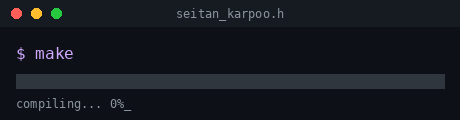

# Seitan_Karpoo 👨‍💻

 

 

<!--
    you found the source. most people just watch the terminal loop and move on.

    the GIF above and the two SVGs below are the same idea told twice:
    something compiles, then it runs — and what "running" looks like
    depends on which GitHub theme you're using.

    if you want to actually talk: [ton contact ici, ex. Discord ou mail]
-->
